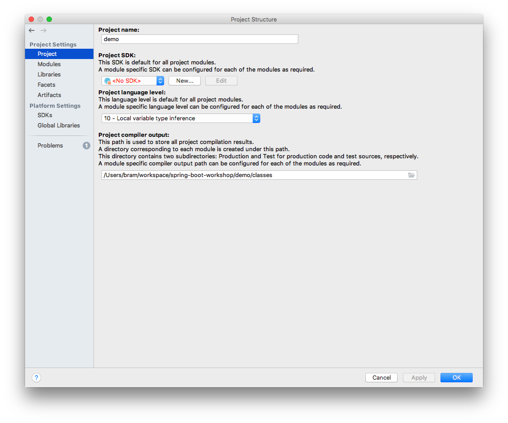
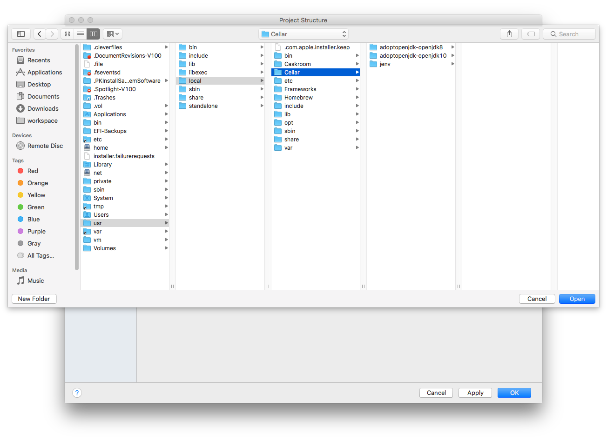

# OpenJDK
With the new licencing options Oracle is deploying with [JDK 11](https://blog.joda.org/2018/09/do-not-fall-into-oracles-java-11-trap.html)
most developers are urging colleagues and clients to switch to OpenJDK. If you haven't already done so, here's a number of
things to do when developing with Java

## OpenJDK or not
The choice for a JDK is up to you. There are several options to choose from and the blog-post by [Stephen Colebouren](https://twitter.com/jodastephen) 
linked above shows you an incentive to shy away from Oracle. And there are quite a number of [options](https://blog.joda.org/2018/09/time-to-look-beyond-oracles-jdk.html).

## Mac
Let's start with Mac OSX, since I (and many of my colleagues) prefer either Mac OSX or Linux as a platform.

### Homebrew

Homebrew at the moment only supports the Oracle standard JDK, but there is a way to add support for OpenJDK.
For openjdk11 use:
```
brew cask install adoptopenjdk
```

For previous versions, use this deprecated cask:
Use the cask for AdoptOpenJDK from [this](https://github.com/AdoptOpenJDK/homebrew-openjdk) Github project.

```
brew tap AdoptOpenJDK/openjdk
brew install <version>
```

The different versions available are:
- adoptopenjdk-openjdk8
- adoptopenjdk-openjdk9
- adoptopenjdk-openjdk10

Source: reply by [George Adams](https://discourse.brew.sh/u/gdams) on [this](https://discourse.brew.sh/t/how-to-install-openjdk-with-brew/712/3) topic.

## Switching JDKs
There are different tools to manage and switch Java versions.

### SDKman
[SDKman](https://sdkman.io/) can be used on *nix systems like Mac OSX and Linux, but also in Windows.
It can also manage Groovy versions. The downside is, that you are limited to the distributions included in SDKman,
which are limited. It does not include 3rd party OpenJDK distributions.

### JEnv
[JEnv](http://www.jenv.be/) can be used in Mac OSX and Linux. It can also be installed on Mac OSX using Homebrew and 
configured using: 
```
brew install jenv
echo 'export PATH="$HOME/.jenv/bin:$PATH"' >> ~/.bash_profile
echo 'eval "$(jenv init -)"' >> ~/.bash_profile
```

The upside is, you can add any JDK version you install to the tool using the `add` command:
```
jenv add /usr/local/Cellar/adoptopenjdk-openjdk10/jdk-10.0.2+13/
jenv add /usr/local/Cellar/adoptopenjdk-openjdk8/jdk8u172-b11/
```

The downside is, you have to install these JDKs yourself, but with Homebrew and the above OpenJDKs that's fine.

### Jabba
[Jabba](https://github.com/shyiko/jabba) supports installation of a list of Java distributions and even from custom URLs.
It can be used in MacOS, Linux, Docker containers and Windows 10 Powershell.


## IntelliJ
Configuring IntelliJ with JDKs should be quite easy. In Project Setting -> Project, then click New -> JDK.


Here comes the tricky part. If you install your JDK with a JDK management-tool, these will often be installed in a hidden directory.
You can enable showing hidden directories in the dialogue Mac OSX using shortcut cmd-shft-dot. Then browse to the directory 
containing the bin-folder and click Open.   


